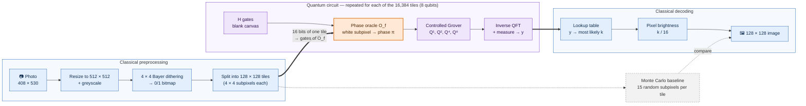

# Figure ①: QSS pipeline

```mermaid
flowchart LR
    subgraph PRE["Classical preprocessing"]
        A["📷 Photo<br/>408 × 530"] --> B["Resize to 512 × 512<br/>+ greyscale"]
        B --> C["4 × 4 Bayer dithering<br/>→ 0/1 bitmap"]
        C --> D["Split into 128 × 128 tiles<br/>(4 × 4 subpixels each)"]
    end

    subgraph QC["Quantum circuit — repeated for each of the 16,384 tiles (8 qubits)"]
        E["H gates<br/>blank canvas"] --> F["Phase oracle O_f<br/>white subpixel → phase π"]
        F --> G["Controlled Grover<br/>Q¹, Q², Q⁴, Q⁸"]
        G --> H["Inverse QFT<br/>+ measure → y"]
    end

    subgraph POST["Classical decoding"]
        I["Lookup table<br/>y → most likely k"] --> J["Pixel brightness<br/>k / 16"]
        J --> K["🖼️ 128 × 128 image"]
    end

    MC["Monte Carlo baseline<br/>15 random subpixels per tile"]

    D ==>|"16 bits of one tile<br/>→ gates of O_f"| F
    H ==> I
    D -.-> MC -.->|"compare"| K

    classDef classical fill:#e3effc,stroke:#2f6db5,color:#0d2a4d
    classDef quantum fill:#efe6fb,stroke:#7a3fc4,color:#2e124f
    classDef key fill:#ffe9d6,stroke:#e07b1f,color:#4a2400,stroke-width:2px
    classDef baseline fill:#f2f2f2,stroke:#8a8a8a,color:#333,stroke-dasharray:4 3

    class A,B,C,D,I,J,K classical
    class E,G,H quantum
    class F key
    class MC baseline

    style PRE fill:#f6faff,stroke:#2f6db5
    style QC fill:#faf6ff,stroke:#7a3fc4
    style POST fill:#f6faff,stroke:#2f6db5
```

- **Blue** = classical, **purple** = quantum, **orange** = where the photo enters the circuit.
- For colour, the whole pipeline is repeated for the R, G and B bitplanes.
